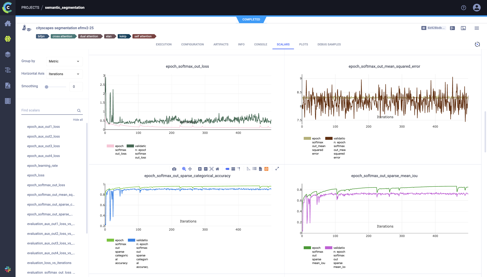

# Cityscapes Semantic Segmentation
### Installation
- Install python >= 3.8, pip
- Run `pip install -r requirements.txt` to install packages

### Usage 
- Run `python3 segmentation.py` to start training model
  - Run `python3 segmentation.py --help` to print help message
- If you have ClearML server configured, logs and models will be automatically uploaded to project **segmentation**
  - If you don't have ClearML server configured or don't wish to upload, change to `DEBUG=True` on `segmentation.py` line 11

### Dataset
- Download data from [Cityscapes website](https://www.cityscapes-dataset.com/)
- Resize the images down to 416x416 or change the shape of input layers `input = tf.keras.Input((416,416,3),name='input')` in `utils.py` 
- Replace `dataset_path = dataset.get_local_copy()` on `segmentation.py` line 185 with your own dataset path
  - If necessary, also change `segmentation.py` line 187 & 188 to fit your dataset folder structure

### Hyparameter Search
- If you have ClearML server configured, you can run `hp_search.py` to perform a Bayesian optimization

### Result

